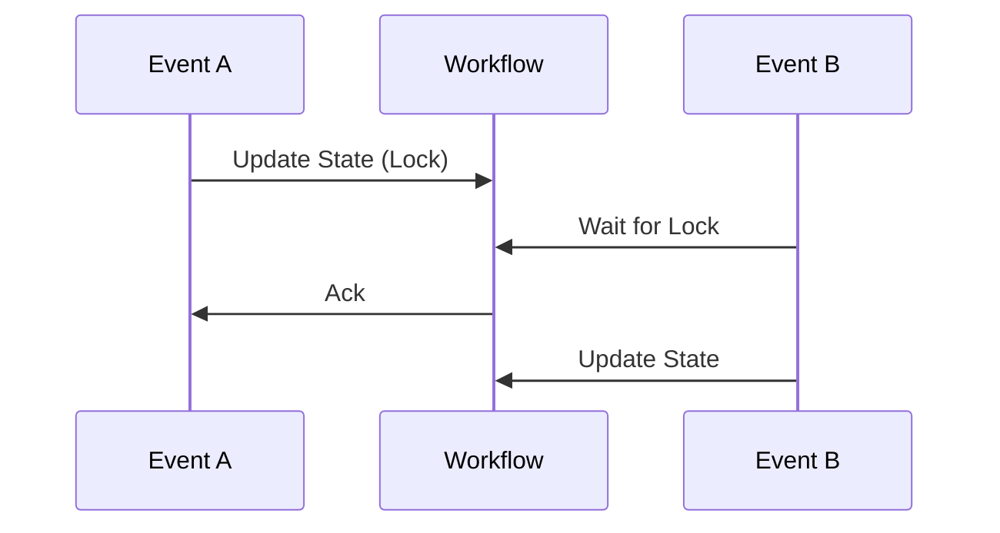

One of the hardest parts of building agentic systems is **State**.
What happens if your server crashes while the LLM is thinking? What happens if a webhook is delivered twice?

Cencori handles this automatically.

## The State Object

Every workflow execution has a persistent JSON state object.

```typescript
// Initial State
{
  "step": "init",
  "data": {}
}
```

When you call `cencori.steps.run()`, we:
1.  Check if this step has *already* run.
2.  If yes, return the cached result (Idempotency).
3.  If no, run it and save the result to state.

## Idempotency Keys

Triggers are idempotent by default if you provide an `id`.

```typescript
// If you send this twice, Cencori only runs it once.
cencori.workflows.trigger('signup-flow', { userId: '123' }, { 
  idempotencyKey: 'signup-123' 
});
```

## Durable Execution

If your Node.js server restarts mid-workflow, Cencori's SDK (when using the Cloud Runner) or your self-hosted worker picks up exactly where it left off.

*   **Completed Steps**: Skipped (cached).
*   **Pending Steps**: Retried.

## Race Conditions

When multiple events hit the same workflow (e.g. `waitFor`), Cencori serializes the updates to the State object to prevent race conditions.



## Best Practices

1.  **Deterministic Steps**: Ensure your steps produce the same output for the same input (or cache them).
2.  **Small State**: Don't store 100MB PDFs in the workflow state. Store the *URL* to S3 instead.
3.  **Versioning**: If you change your workflow code, existing executions might break. Use `v1`, `v2` naming for critical flows.
